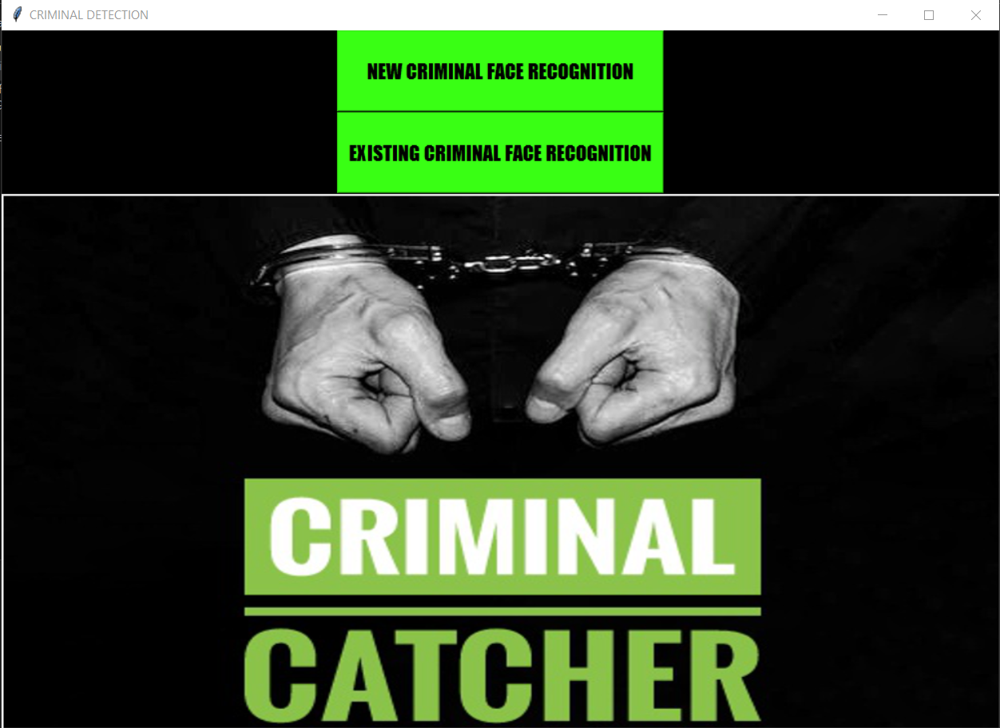
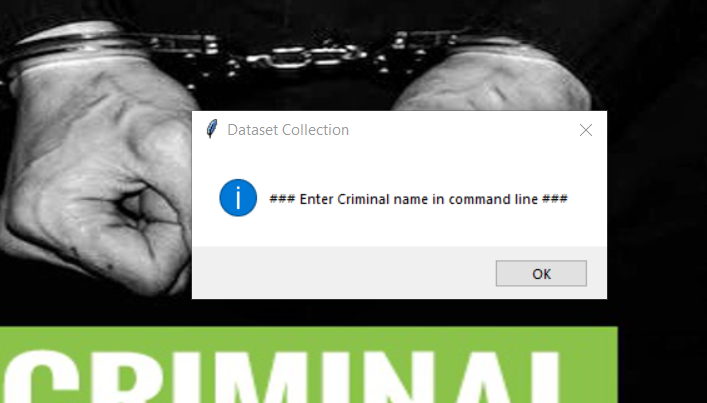
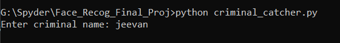
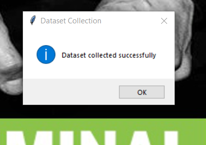
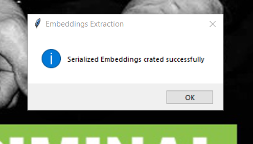
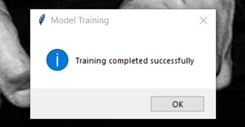
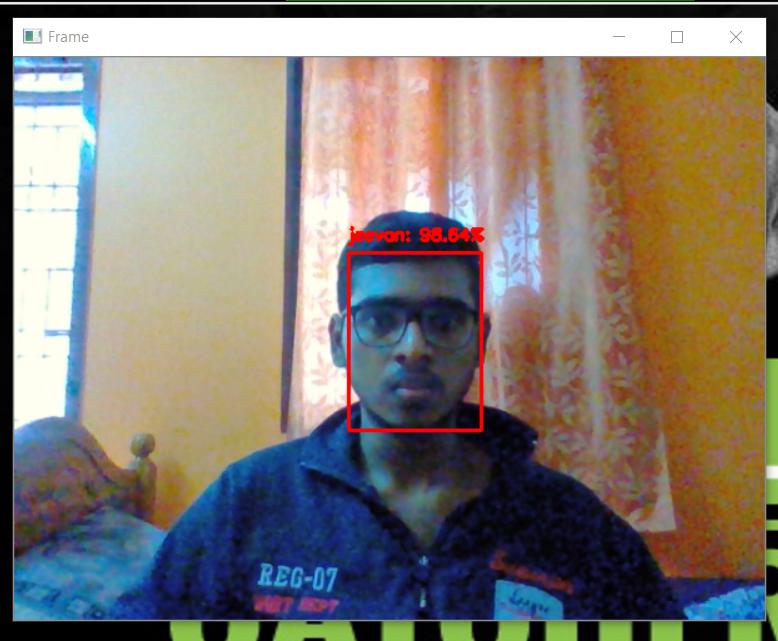

# Criminal-face-recognition-using-OpenCV-and-tkinter CRIMINAL_CATCHER
CRIMINAL_FACE_RECOGNITION using OpenFace Deep Learning model and OpenCV's DNN module from Caffe with GUI elements.

An automated facial recognition system for criminal database is proposed.

PROBLEM STATEMENT : TO HELP THE LAW ENFORCEMENTS TO RECOGNIZE SUSPECT OF THE CASE.

Problem Description: The approach we  use for face recognition is :

                                      1. Openface deep learning model by torch  
                                      2. DNN module from caffe model by OpenCV
                                      
Openface is an open source library and it is a deep learning facial recognition model implemented using python and torch( computing framework to do training ) , as it can run on CPUs and GPUs. 
Deep Neural Network (DNN) module in OpenCV allowsus to use pretrained neural network from popular frameworks like caffe to train models and then do prediction with OpenCV .
For better user experience we have used GUI elements with tkinter.

WORKING:

--> Collecting the face dataset  
--> Extracting 128-d serialized embeddings  
--> Model training  
--> Saving label encoders and SVM classifier  
--> Recognizing the face  

HOW TO RUN:

Clone this repository and run criminal_catcher.py
*Don't forget to download "openface_nn4.small2.v1.t7" and save it in OpenFace_embedding_model directory.

SCREENSHOTS:

  
      

      

      

      

      

      

